# Dead-Letter Handling — Architecture & Design (V1 Proposal)

**Status:** design only — nothing in this document has been implemented.
**Scope:** an optional, additive feature. Off-path by default cost is zero; on-path cost is bounded to the failure branch only.

---

## 0. Grounding: how ingestion actually fails today

Before designing anything, here is what `POST /logs` actually does today (`LogEntryValidator` → `LogIngestionService.ingest()` → `LogRepository.insertMany()` → write-coalescing queue → `flushBatch()`), and where it can currently lose data silently.

```
POST /logs
  │
  ▼
LogEntryValidator.validateBatch()        malformed JSON / wrong shape → 400, nothing persisted
  │
  ▼
per-entry LogEntryValidator.validateEntry()   invalid entry → added to `rejected[]`, 400/200 per existing rule
  │  (valid entries only)
  ▼
LogRepository.insertMany()
  │
  ├─ backpressure.checkAdmission()        over absolute cap → 413 (throws BEFORE queueing)
  │                                        over headroom     → 503 + Retry-After (throws BEFORE queueing)
  │
  ▼  (admitted)
pendingInserts queue (write coalescing)
  │
  ▼
flushBatch(): dataSource.transaction(insertLogsIn + upsertRollups)
  │
  ├─ COMMIT  → every caller's promise resolve()s → 200
  │
  └─ THROW   → every caller's promise reject()s with the raw driver error
                  → LogIngestionService has no catch for this error type
                  → propagates to GlobalExceptionFilter's catch-all
                  → 500 "Internal server error", logged once via Logger.error
                  → *the batch's data is gone*: it only ever existed in the
                    in-memory `pendingInserts` array, which is discarded the
                    moment the promise settles.
```

**The gap this feature closes is narrow and specific:** the last branch. Everything upstream of it (validation, backpressure) already produces a correct, informative response and never had a durability problem to begin with — there was never anything to lose, because nothing was ever accepted.

---

## 1. What should — and should not — become a dead letter

| # | Case | Dead letter? | Response | Retry? | Why |
|---|------|:---:|---|:---:|---|
| 1 | Individual entry fails validation | **No** | Existing per-entry 400 rejection (`{index, reason}`) | No | The client is already told exactly what's wrong, synchronously, with enough detail to fix and resend. Dead-lettering invalid input would mean silently warehousing garbage and inviting DLQ-flooding from a buggy/malicious client. Retrying literally-invalid data changes nothing — same input, same failure, forever. |
| 2 | Entire request malformed (bad JSON / wrong top-level shape) | **No** | Existing 400 | No | Same reasoning as #1, one level up. There isn't even a `logs` array to attempt persisting. |
| 3 | Valid request rejected by backpressure | **No — structurally cannot be** | Existing 503 + `Retry-After` | Client-driven (per `Retry-After`) | `checkAdmission()` throws *before* `pendingInserts.push()` — the batch never enters the coalescing queue, never reaches `flushBatch()`, the only place dead-lettering happens. This isn't a policy choice enforced by convention; it's enforced by where the throw sits in the code. Treating shed load as "dead" would turn the DLQ into a second unbounded queue sitting behind the first one, defeating backpressure's entire purpose and contradicting the load-generator contract (shed requests don't count as ingested). |
| 4 | Valid, admitted logs fail because Postgres is temporarily unavailable | **Yes, after a bounded in-flush retry** | Existing 500 (unchanged contract) | **Yes** — 2–3 bounded, immediate retries inside `flushBatch()` before giving up | The batch was already accepted (capacity reserved, caller told nothing was wrong yet). A connection blip is often sub-second; a couple of quick retries turn many of these into silent successes with zero client-visible impact. Only after retries are exhausted does it become a dead letter — see case 6. |
| 5 | Permanent processing failure (e.g. a constraint/data error unrelated to availability) | **Yes, immediately, no retry** | Existing 500 (unchanged contract) | No | Deterministic failures fail identically on retry — retrying just delays the response and wastes a Postgres round-trip while it may already be struggling. Classified by SQLSTATE class (see §4). |
| 6 | A retry eventually exhausts its retry policy | **Yes** (terminal state of #4) | Existing 500 (unchanged contract) | No further automatic retries | This *is* case 4's outcome once the bounded retry budget is spent. `attempt_count` on the resulting row records how many tries were made. |

**Key structural point:** dead-lettering plugs into the *existing* `flushBatch()` catch block — the one place all post-admission ingestion failures already funnel through. No new interception point, no new queue, no change to `LogIngestionService` or `GlobalExceptionFilter` (client-facing responses are byte-for-byte unchanged).

---

## 2. Data model

### 2.1 Why the proposed schema needs one structural change before anything else

`flushBatch()` coalesces **multiple callers, potentially from different tenants**, into a single transaction (`takeBatch()` groups purely by row-count headroom, not by tenant — see `log.repository.ts`). This means a single failed flush's `logs` array can span tenants.

The schema you proposed has one `tenant_id` column per row, which implicitly assumes one dead letter = one tenant = one flush. That assumption breaks the moment two different tenants happen to be coalesced into the same failing flush — a single row would either force mixing two tenants' data under one `tenant_id`, or the API would have to special-case "some entries in this row aren't actually yours." Either way it's a tenant-isolation defect waiting to happen.

**Fix:** group the failed batch's rows **by `tenant_id` in memory** before persisting — the exact same technique `groupIntoRollupDeltas()` already uses for rollup deltas in the same file — and write **one `dead_letters` row per tenant represented in the failed flush**, each row's payload containing only that tenant's entries. This is cheap (one O(n) pass, no extra query), keeps row count proportional to "how many distinct tenants were unlucky enough to be coalesced into a failing flush" (typically 1, rarely more than a handful) rather than per-entry, and makes tenant isolation an invariant of the write path itself rather than something every read has to re-enforce.

### 2.2 Revised schema

```sql
CREATE TYPE dead_letter_status        AS ENUM ('DEAD', 'RESOLVED', 'DISMISSED');
CREATE TYPE dead_letter_failure_type  AS ENUM ('TRANSIENT', 'PERMANENT');

CREATE TABLE dead_letters (
  id                UUID                      NOT NULL DEFAULT gen_random_uuid(),
  tenant_id         UUID                      NOT NULL,
  source            TEXT                      NOT NULL DEFAULT 'ingestion_flush',
  failure_type      dead_letter_failure_type  NOT NULL,
  failure_reason    TEXT                      NOT NULL,
  original_payload  JSONB                     NOT NULL,
  entry_count       INTEGER                   NOT NULL,
  attempt_count     INTEGER                   NOT NULL DEFAULT 1,
  status            dead_letter_status        NOT NULL DEFAULT 'DEAD',
  created_at        TIMESTAMPTZ               NOT NULL DEFAULT CURRENT_TIMESTAMP,
  last_failed_at    TIMESTAMPTZ               NOT NULL DEFAULT CURRENT_TIMESTAMP,
  resolved_at       TIMESTAMPTZ,

  CONSTRAINT pk_dead_letters PRIMARY KEY (id),
  CONSTRAINT chk_dead_letters_source CHECK (source IN ('ingestion_flush')),
  CONSTRAINT chk_dead_letters_payload_array CHECK (jsonb_typeof(original_payload) = 'array'),
  CONSTRAINT chk_dead_letters_entry_count_positive CHECK (entry_count > 0)
);

CREATE INDEX idx_dead_letters_tenant_created ON dead_letters (tenant_id, created_at DESC);
```

Changes from your strawman, and why:

| Change | Reasoning |
|---|---|
| Added `entry_count` | The list endpoint (§6) shouldn't have to inflate `original_payload` just to show "how many entries." Cheap, denormalized, set once at write time. |
| `failure_type` is a closed enum (`TRANSIENT` / `PERMANENT`), not free text | It's a small, stable, genuinely load-bearing set that drives whether an operator should bother clicking replay. Matches this project's convention of using a real Postgres enum (`log_level`) for closed, central sets. |
| `source` stays plain `TEXT` + `CHECK`, not an enum type | It has exactly one legitimate value today (`ingestion_flush` — the only place in this codebase that can dead-letter something). A `CHECK` constraint is cheaper to extend later than a Postgres enum type if a second producer (e.g. a future rollup-repair job) ever appears. Kept for forward-compatibility, not because V1 needs more than one value. |
| No FK from `tenant_id` → `tenants.id` (open question, see §15) | `logs.tenant_id` deliberately skips this FK for hot-path performance (research.md Decision 6 of the multi-tenancy feature). That reasoning doesn't apply here — dead-letter writes are rare, not hot-path — so an FK (with `ON DELETE CASCADE`, per this repo's DBML convention for documenting delete behavior) would be *free* here and would auto-clean a deleted tenant's dead letters. Left as an open question only because I haven't confirmed tenants are ever deletable in this system. |
| `id` is UUID, not a bigint identity | Matches this project's tenancy-resource convention (tenants, API keys) rather than the `logs`/`log_rollups` convention (which uses bigint/composite PKs purely because those tables are hot-path and partitioned). A dead letter is an operator-facing resource, closer in kind to a tenant/API-key than to a log row. |
| Single composite index, `(tenant_id, created_at DESC)` | Covers the only query V1 needs — "list my tenant's dead letters, newest first," optionally filtered by `status` in the same scan. Per this project's stated performance principle (don't index blindly), no separate index on `status`/`failure_type` — expected row counts don't justify one. |

### 2.3 What's stored, and what deliberately is not

**Stored:** `original_payload` is the exact array of log entries (`timestamp`, `level`, `service`, `message`, `attributes`, `tenant_id` — the same shape `NewLog` already has) that would have gone into `logs` had the transaction committed. This is *not* new sensitive-data exposure: it's the identical user-supplied content the `logs` table already stores today when ingestion succeeds. If it's safe enough to log durably on the happy path, it's safe enough to log durably on the failure path — the risk profile doesn't change, only the table does.

**Never stored:**
- Request headers, `Authorization`/API-key values — structurally impossible to leak, since the ingestion payload is `{logs: [...]}` only; credentials are never in the body per this project's own contract.
- Raw driver stack traces / connection strings in `failure_reason` — the DB error is sanitized down to `SQLSTATE + a short message` before persisting (truncated, e.g. 2000 chars) and the *full* stack trace goes to the existing `Logger.error` (application logs), exactly like `GlobalExceptionFilter` already does for unhandled 500s. No reason to duplicate a full stack trace into every DLQ row — it bloats the table for zero operational benefit once it's already in the app log.

**Bounded payload size, by construction, not by policy:** a batch can only be dead-lettered if it was first successfully *admitted*. When backpressure is enabled, admission already caps a batch at `BACKPRESSURE_MAX_PENDING_ROWS` / `BACKPRESSURE_MAX_PENDING_BYTES` (default 20,000 rows / 25MB). When disabled, a batch is bounded by `INGEST_COALESCE_MAX_ROWS` (default 2,000) per caller, coalesced across at most a few callers. Either way, the worst-case `original_payload` size is an existing, already-configured bound — nothing new to tune.

### 2.4 Indexing, volume, retention

- **Expected volume:** near-zero under normal operation. This table only grows during genuine incidents (Postgres blips, bugs). Realistic worst case is low hundreds of rows even during a bad incident — nothing remotely close to `logs`' million-row scale.
- **Indexing:** one composite btree, `(tenant_id, created_at DESC)`, plus the implicit PK index on `id`. No partitioning (unlike `logs`) — volume never approaches the scale that motivated partitioning there.
- **Retention: none, by default, in V1.** Given the expected volume is tiny, auto-deleting dead letters risks silently discarding evidence of an undiagnosed incident. If this table ever grows large enough to matter, that growth is itself a signal something is operationally wrong and deserves a human's attention, not silent cleanup. A scheduled purge of old `RESOLVED`/`DISMISSED` rows is a reasonable *future* addition (mirroring `RetentionScheduler`'s cron pattern) but isn't required for V1 — flagged as a stretch, not a default.

### 2.5 Write performance impact, batching, and transaction placement

- **Never part of the main ingestion transaction.** It structurally can't be — the reason a dead-letter write happens at all is that the main transaction just failed and rolled back; a Postgres transaction aborts entirely on its first error, so no further statements can be issued on that same connection/transaction. The dead-letter write is a **new, separate `dataSource.transaction()` call**, issued from the `catch` block, which checks out a fresh connection from the same write pool.
- **Not batched across flushes.** Each failed flush's dead-letter write (already batched *within itself* by the per-tenant grouping in §2.1) happens immediately, once, in that flush's own catch block. There's no case for further batching multiple *different* failed flushes' writes together — this is a rare failure-path operation, not a throughput path; building a second coalescing mechanism to optimize something that should almost never happen would be over-engineering the wrong problem.
- **Happy-path cost: zero.** No new column on `logs`, no new check on every insert, no new query in `findPage()` or `aggregate()`. The dead-letter write only executes on the branch that was already failing and already returning a 500 — it cannot regress the 15k logs/sec target or the aggregation p95, because it never runs unless ingestion has already stopped succeeding for that flush.

### 2.6 If Postgres itself is unavailable

This is the honest limit of a Postgres-only DLQ, worth stating plainly rather than glossing over: **if Postgres is genuinely down (not just slow), the dead-letter write will also fail**, because `dead_letters` lives in the same Postgres instance the project's constraints require as the sole source of truth. At that point:

- The bounded in-flush retry (§1, case 4) will already have tried a few times.
- The dead-letter write attempt is itself wrapped so its failure doesn't throw a *new*, different error to the client — the original failure is what gets returned (existing 500, unchanged).
- The failure — including the fact that the dead-letter write also failed — is logged via the existing `Logger.error`, so there's at least a trace in stdout/container logs (typically shipped elsewhere in real deployments) even though nothing is durably queryable via the DLQ API in this specific worst case.

No in-process, single-Postgres design can fully solve "the database itself is gone" without external durable infrastructure — which is precisely the class of complexity (Kafka/RabbitMQ/Redis) this project's constraints ask to avoid absent a strong reason. A full Postgres outage already has this exact property for the *primary* `logs` writes today; the DLQ doesn't regress anything, it just doesn't extend durability past a boundary nothing else in this system extends past either.

---

## 3. Lifecycle

Your two proposed options were:

```
FAILED → DEAD → RETRYING → RESOLVED          (option A)
DEAD → RESOLVED / DISMISSED                    (option B)
```

**Recommendation: a variant of option B**, deliberately simpler than option A:

```
        ┌────────────► RESOLVED   (manual replay succeeded)
DEAD ───┤
        └────────────► DISMISSED  (operator decided not to recover it)

DEAD ───► DEAD  (replay attempted, failed again — attempt_count++, last_failed_at updated, no new row)
```

Why not a persisted `RETRYING` state: if replay is synchronous within a single API call (§4), `RETRYING` never needs to be durably observable — nothing else queries the row mid-flight, and a single HTTP request/row-lock already serializes concurrent attempts. Persisting a state that nothing ever reads is complexity without payoff. There's also no `FAILED` state distinct from `DEAD`: nothing in this design ever creates a row that isn't already terminal-for-now the moment it's written (a row only gets created *after* retries are exhausted — see case 6 in §1) — `FAILED` and `DEAD` would be the same state wearing two names.

---

## 4. Bounded in-flush retry (case 4/6) — classification

Not every flush failure deserves a retry. Postgres error codes (`SQLSTATE`) give a standard, non-heuristic way to tell "worth a quick retry" apart from "will fail identically every time":

- **Transient** (retry): SQLSTATE class `08` (connection exception), `53` (insufficient resources — too many connections, out of memory), `57` (operator intervention — admin shutdown, crash recovery in progress).
- **Permanent** (no retry, immediate dead-letter): everything else — constraint violations (`23xxx`), data exceptions (`22xxx`), etc. Since every entry was already validated by `LogEntryValidator` before reaching `LogRepository`, a genuine permanent failure here should be rare in practice — it mostly indicates either an edge case that slipped past validation or a real bug in the SQL this repository issues.

Retry budget: 2–3 attempts, short fixed/backoff delay (e.g. 50ms, 150ms), applied to the **whole flush batch** (the same transactional unit that failed — not sub-divided by tenant; only the *resulting dead-letter write*, if retries are exhausted, is split by tenant per §2.1). This adds latency only to the callers already waiting on a failing flush; it never touches a successful flush, and it never touches other queued batches beyond the ordinary serialization the existing single-flight flush loop already imposes.

---

## 5. Replay: duplicate-safety analysis (and why V1 stays manual-only)

**Is there an idempotency key today?** No. `logs.id` is an auto-generated identity column; nothing in the core spec or this codebase gives a client-supplied or content-derived dedup key for a log entry. Adding one would be a real change to the core ingestion contract — out of scope for a DLQ feature, and explicitly against the instruction to preserve the existing API contract.

**Is replay safe anyway?** Mostly, and for a clean structural reason: Postgres transactions are atomic. A dead letter, by construction, only exists because its wrapping transaction *rolled back* — meaning **zero** of its rows are in `logs` (there is no partial-commit case to worry about; either the whole transaction landed, in which case it was never dead-lettered, or none of it did). So the first replay of a `DEAD` row is safe from "did some of this already commit."

**The actual duplicate risk is narrower: replaying the *same* dead-letter row more than once** — an operator double-clicking replay, or two concurrent replay attempts racing. This is closed with a simple, already-idiomatic-to-this-codebase guard: the transition `DEAD → RESOLVED` is a conditional `UPDATE ... WHERE id = $1 AND tenant_id = $2 AND status = 'DEAD'`. Only one concurrent caller can ever match that `WHERE` clause; a second attempt affects zero rows and is rejected as a no-op/conflict. (This mirrors the advisory-lock pattern `RetentionService` already uses to keep concurrent maintenance runs from double-processing the same work.)

**So why not make replay automatic, if the guard already prevents duplication?** Because "safe from duplicate writes" isn't the same as "advisable to run unattended":

1. Automatically retrying a row already classified `PERMANENT` would just fail forever, burning Postgres round-trips for no benefit — possibly *during* the exact incident that caused the original failure.
2. Auto-replay removes the human checkpoint that's actually valuable here: dead letters are rare and should be rare — a person noticing *why* something died (a pattern across services, a bad deploy, a disk filling up) before deciding to resubmit is real operational value that a silent auto-heal throws away.
3. A background retry sweep needs its own coordination (multi-instance safety, backoff, jitter) to avoid a thundering herd hitting Postgres the moment it flickers back up — real additional complexity for a table whose expected volume doesn't justify it yet.

**Recommendation:** V1 replay is **manual, operator-initiated, status-guarded** — safe against duplication today, deliberately conservative about *when* it fires. An automatic background retry sweep (architecture "B" in §7) is a reasonable, data-driven future addition once real incident volume is observed — not a V1 default.

**Replay reuses the existing ingestion path, it does not bypass it.** A replay is implemented as calling `LogRepository.insertMany()` again with the dead letter's stored payload, scoped to its `tenant_id` — not a bespoke `INSERT INTO logs`. This means replay automatically inherits: the same transactional `insertLogsIn` + `upsertRollups` pairing (rollups only ever increment atomically with the row insert, exactly as today), and the same backpressure admission check (if the system is currently saturated, a replay can itself be shed with a 503 — entirely consistent, zero special-casing). If a replay attempt fails, the *same* row is updated in place (`attempt_count++`, `last_failed_at` bumped) — it never creates a second dead-letter row for the same data.

---

## 6. V1 scope: which capabilities, which endpoints

| Capability | V1? | Notes |
|---|:---:|---|
| Inspection (list + detail) | **Yes** | Core value of the feature — nothing else matters if operators can't see what died. |
| Dismiss | **Yes** | Cheap, high-value: lets an operator clear the "needs attention" list without destroying the audit record. |
| Manual replay | **Yes** | See §5 — safe with the status guard, deliberately not automatic. |
| Automatic in-flush retry | **Yes** | Narrow, bounded, same-transaction-lineage (§4) — not the same thing as replay. |
| Automatic replay of already-dead-lettered rows | **No** | Deferred — see §5, §7. |
| Hard delete | **No, deliberately** | See below. |

**Recommended endpoints** (additive; the four required endpoints are untouched):

```
GET    /dead-letters              list, tenant-scoped, paginated, optional ?status= filter
GET    /dead-letters/:id          full detail, including original_payload
POST   /dead-letters/:id/replay   manual replay (DEAD → RESOLVED on success)
POST   /dead-letters/:id/dismiss  DEAD → DISMISSED
```

Two deliberate departures from your strawman list:

- **Renamed `retry` → `replay`.** "Retry" is already the name for the automatic in-flush mechanism in §4 — a totally different thing happening in a totally different place. Reusing the word for the manual operator action would make the two easy to confuse in conversation, code, and metrics.
- **Dropped `DELETE /dead-letters/:id` from V1.** A dead-letter row *is* the audit trail of an incident; hard-deleting it destroys evidence with no way to reconstruct why something failed later. "Dismiss" already provides the operational affordance actually needed ("stop showing me this") without destroying the record. A real hard-delete has a legitimate *future* purpose (e.g. compliance/right-to-erasure on payload content) but that's a different, more sensitive concern than "reliability feature V1" and shouldn't be bundled in reflexively.

All four endpoints reuse `ApiKeyAuthGuard` + `@CurrentTenantId()`, exactly like `LogsController` — same `AUTH_ENABLED` behavior, same zero-config default (unauthenticated, scoped to `DEFAULT_TENANT_ID`, when auth is off), no new auth concept. Every query (list, get, replay, dismiss) filters by `tenant_id = currentTenantId` **in the SQL itself**, never "fetch by id then check in application code" — a point lookup for an id belonging to another tenant returns 404, not a differently-shaped error that could leak existence.

Pagination for the list endpoint: given the expected volume (§2.4) is tiny relative to `logs`, the full opaque-cursor machinery built for `GET /logs` (justified there by million-row scale) is disproportionate here. A light keyset (`limit` + optional `created_at`/`id` cursor) is enough — left as an implementation-time detail, not dictated further here.

---

## 7. Architecture comparison

| | **A. Postgres table only** (+ bounded in-flush retry) | **B. Postgres table + background retry worker** | **C. External durable broker + Postgres** | **D. No DLQ, error logging only** |
|---|---|---|---|---|
| **Benefits** | Durable audit trail; manual recovery path; zero happy-path cost; reuses existing patterns (transactional grouping, advisory-lock-style guards) | Everything in A, plus unattended recovery from transient blips | Independent durability substrate; could survive a Postgres outage in theory | Zero implementation cost, zero new resource usage |
| **Drawbacks** | No unattended recovery — a human must click replay | Real added complexity: multi-instance coordination, backoff/jitter, thundering-herd risk on Postgres recovery; masks operator visibility into incidents | Contradicts the explicit "no broker without strong reason" constraint; the broker still needs Postgres as source of truth per this project's own rules, so it adds no *real* durability beyond what A already gives, only orchestration convenience | No durable record of *what* failed, only a log line; no recovery path if the client doesn't retry on its own |
| **Durability** | Bounded by Postgres availability — same boundary the project's primary data already has | Same as A | Marginally better only if the broker is genuinely external/independent — otherwise identical to A, just with extra moving parts | None beyond an ephemeral container log line |
| **Complexity** | Low — one new module, one catch-block integration point | Medium — a new scheduled worker, coordination logic | High — new deployable, new operational surface, breaks "zero config, `docker compose up`" simplicity for the whole project | None |
| **Resource cost** | Negligible (rare writes, tiny table, no partitioning) | Slightly more (periodic scan/cron) | New container(s); app is capped at 0.5 CPU/256MB with no headroom for an embedded consumer | None |
| **Fit for this project** | **Strong** — matches expected (near-zero) failure volume, respects the resource caps, reuses existing idioms | Plausible *later*, once real incident data justifies the added complexity | **Poor** — actively works against stated constraints for uncertain benefit | Weak — the status quo, and the reason this feature was requested |

**Recommendation: Architecture A** — a Postgres-backed `dead_letters` table with the bounded in-flush retry from §4, manual replay/dismiss from §6, and explicitly no background worker in V1. Architecture B is the natural, well-defined next step once actual production incident volume shows it's worth the added coordination complexity — this is a "measure before optimizing" call, consistent with how this project has treated performance work elsewhere.

---

## 8. Interaction with existing subsystems

| Subsystem | Interaction |
|---|---|
| **Validation** | None. Dead-lettering only ever sees entries that already passed `LogEntryValidator` and were admitted. Rejected entries never reach `LogRepository`. |
| **Write coalescing** | Direct integration point: the `catch` block of the existing `flushBatch()`. No new queue, no new timer — reuses the exact transactional/settlement boundary that already exists. |
| **Backpressure** | Structurally orthogonal (§1, case 3) — `checkAdmission()` throws before an entry ever enters `pendingInserts`, so a backpressure rejection cannot reach `flushBatch()` and therefore cannot become a dead letter. Replay itself re-enters through `insertMany()`, so it *is* subject to backpressure like any other ingestion call — deliberately, for consistency (§5). |
| **PostgreSQL transactions** | The dead-letter write is a separate, subsequent `dataSource.transaction()` call, issued only after the original transaction has already rolled back. It can never be nested inside, or share a connection with, the failed transaction (Postgres won't allow further statements on an aborted transaction anyway). |
| **Rollups** | `insertLogsIn` and `upsertRollups` already run in one transaction; a rollback undoes both atomically. A dead-lettered batch's rollup deltas are therefore *never* applied — this is a property the existing (specs/002) design already guarantees, not something this feature adds. Replay must reuse the same transactional path (not a bypass `INSERT INTO logs`) so a successful replay's rollup increments stay exactly-once and consistent. |
| **Retention** | No interaction. `dead_letters` is a separate, non-partitioned table entirely outside `RetentionService`'s partition-drop/bulk-delete logic. Its own retention policy (§2.4: none in V1) is independent. |
| **Authentication** | Reuses `ApiKeyAuthGuard` exactly as `LogsController` does — inherits `AUTH_ENABLED` behavior for free. `LOADGEN_API_KEY` never touches these endpoints (the load generator has no reason to call them; they're additive per the project's Golden Rule). |
| **Multi-tenancy** | Enforced twice: at write time (per-tenant grouping, §2.1 — one row is never mixed-tenant) and at read/write-action time (every query filters by `tenant_id = currentTenantId` in SQL). |
| **Graceful shutdown** | This project currently has no shutdown hooks at all (no `enableShutdownHooks`/`SIGTERM` handling found in `main.ts` or elsewhere) — a hard kill mid-flush can already lose in-flight data today, independent of this feature. Dead-lettering does **not** fix this: a flush killed mid-transaction by a `SIGKILL` never reaches the `catch` block, so nothing gets dead-lettered either. This is an existing, acknowledged gap this feature doesn't claim to close — flagged explicitly rather than papered over. Adding shutdown hooks would be a reasonable, separate improvement, out of scope here. |
| **Application restart** | `dead_letters` rows are ordinary durable Postgres state — they survive restarts with no special handling, same as every other table. |
| **Performance requirements** | Provably zero cost on the measured happy path (§2.5) — nothing this feature adds executes unless a flush has already failed. |

---

## 9. Correctness invariants

| Invariant | How it's guaranteed |
|---|---|
| Dead letters never appear in normal log queries or aggregations | Physically separate table. `findPage()`/`aggregate()` only ever touch `logs`/`log_rollups` via `readRepository`/`rollupReadRepository`, which have no knowledge of `dead_letters`. Structurally impossible to leak — not a filter that could be forgotten. |
| A dead-letter failure must never corrupt rollup counts | `insertLogsIn` + `upsertRollups` share one transaction; any failure rolls back both atomically. Inherited for free from the existing transactional design — this feature only has to avoid *bypassing* it on replay (§5, §8). |
| Tenant A can never inspect tenant B's dead letters | Per-tenant row grouping at write time (§2.1) + `tenant_id = currentTenantId` in every query's `WHERE` clause + the same guard/decorator already proven correct for `/logs`. |
| A 503 caused by backpressure is not a dead letter | `checkAdmission()` throws before the entry is ever queued — enforced by code structure, not policy (§1, case 3; §8). |
| HTTP 200 must never be returned for data that was not durably accepted | Unchanged from today: a caller's promise only `resolve()`s after the wrapping transaction commits. Dead-letter persistence is a side effect attempted strictly *after* the decision to reject has already been made — it can never flip a reject into a 200. |
| Replay must not silently create duplicate business effects | Status-guarded conditional transition (`UPDATE ... WHERE status = 'DEAD'`), manual-only in V1, replay reused through the same atomic ingestion path (§5). |

---

## 10. Proposed architecture diagram

```mermaid
flowchart TD
    A["POST /logs"] --> B["LogEntryValidator"]
    B -->|malformed / all rejected| C["400 (unchanged)"]
    B -->|valid entries| D["LogRepository.insertMany()"]
    D --> E{"checkAdmission()"}
    E -->|over absolute cap| F["413 (unchanged)"]
    E -->|no headroom| G["503 + Retry-After (unchanged)"]
    E -->|admitted| H["pendingInserts queue\n(write coalescing, unchanged)"]
    H --> I["flushBatch():\ndataSource.transaction\n(insertLogsIn + upsertRollups)"]
    I -->|COMMIT| J["resolve() every caller\n200 (unchanged)"]
    I -->|throws| K{"Bounded in-flush retry\n(2-3x, transient only)"}
    K -->|recovers| J
    K -->|exhausted / permanent| L["Group failed batch by tenant_id"]
    L --> M["New transaction:\nINSERT dead_letters\n(one row per tenant)"]
    M --> N["reject() every caller\n500 (unchanged)"]
    M -.->|if Postgres itself is down| O["Logger.error only\n(acknowledged limitation, §2.6)"]

    P["GET /dead-letters"] -.tenant-scoped, ApiKeyAuthGuard.-> Q[("dead_letters table")]
    R["GET /dead-letters/:id"] -.-> Q
    S["POST /dead-letters/:id/dismiss"] -.-> Q
    T["POST /dead-letters/:id/replay"] -->|calls| D
    T -.status-guarded UPDATE.-> Q
    M --> Q

    style F fill:#553,stroke:#a85
    style G fill:#553,stroke:#a85
    style C fill:#553,stroke:#a85
    style N fill:#553,stroke:#a85
    style J fill:#354,stroke:#5a8
    style Q fill:#345,stroke:#58a
```



---

## 11. Code-impact map

| File / module | Change |
|---|---|
| `src/logs/repositories/log.repository.ts` | `flushBatch()`'s `catch` block gains: bounded retry loop (transient-only, §4) and a call to a new, narrow dead-letter recorder on final failure. New private helper mirroring `groupIntoRollupDeltas()` for the per-tenant split (§2.1). |
| **New:** `src/dead-letters/` module | New top-level module, sibling to `logs/`, `tenancy/`, `retention/` (matches this project's module-per-concern layout): `dead-letters.module.ts`, `dead-letters.controller.ts`, `services/dead-letter.service.ts` (list/get/replay/dismiss), a small recorder service injected into `LogRepository` (single method, e.g. `recordFailedBatch(...)`, keeping the persistence/grouping logic *out* of `LogRepository` so it doesn't bloat — matching the "small cohesive helpers only if justified" precedent already set by the backpressure feature), `entities/dead-letter.entity.ts`, DTOs, `enums/dead-letter-status.enum.ts`, `enums/dead-letter-failure-type.enum.ts`. |
| `src/logs/logs.module.ts` | Imports the new `DeadLettersModule` (or exports the recorder service) so `LogRepository` can inject it. |
| **New migration(s)** | `dead_letters` table, `dead_letter_status` / `dead_letter_failure_type` enum types, the one composite index — following this project's existing migration-per-concern convention (structure separate from indexes, as `CreateLogsTable` / `CreateLogsTableBtreeIndexes` already model). |
| `projectSchema.dbml` | Updated per this repo's mandatory schema-doc rule (CLAUDE.md) — at implementation time, not now. |
| `requests/dead-letters/*.rest` | One `.rest` file per new endpoint, per this repo's HTTP-request-file convention — at implementation time. |
| `.env.example`, `docker-compose.yml` | New, small config block (see §14) — mirrors the existing `backpressure.config.ts` / `retention.constants.ts` pattern: centralized, validated once, sane defaults. |
| `src/logs/services/log-ingestion.service.ts` | **Unchanged.** Still only catches the two backpressure-specific error types; a flush failure still propagates as today (500). |
| `src/common/filters/global-exception.filter.ts` | **Unchanged.** Dead-letter recording is entirely internal to `LogRepository`'s catch block and never touches the HTTP-translation layer. |
| `README.md` | New "Dead-Letter Handling" optional-feature section — mirrors how Backpressure/Multi-tenancy are already documented (default state, env vars, confirmation zero-config is unaffected). |

---

## 12. Risks and trade-offs

- **No unattended recovery in V1.** A transient incident that outlasts the bounded in-flush retry requires a human to notice and click replay. Accepted trade-off (§5, §7) — the alternative (background worker) adds real complexity for a benefit that's currently speculative given expected volume.
- **A full Postgres outage defeats the DLQ too (§2.6).** This is an honest limitation of staying Postgres-only, not a defect specific to this design — it's the same boundary the project's primary data already has.
- **`original_payload` duplicates data that, on a successful replay, will also exist in `logs`.** Slight storage redundancy for resolved dead letters, traded for keeping the audit trail intact (no automatic deletion — §2.4) rather than reflexively cleaning up after a successful replay.
- **Per-tenant grouping adds a small in-memory pass to the failure path.** O(batch size), bounded by the same caps already governing batch size (§2.3) — negligible, and only runs when a flush has already failed.

---

## 13. Functional requirements

- **FR-1** A batch that fails validation, in whole or in part, MUST NOT produce a dead letter for the rejected portion; the existing per-entry 400 behavior is unchanged.
- **FR-2** A request rejected by backpressure (413 or 503) MUST NOT produce a dead letter.
- **FR-3** A batch that fails during `flushBatch()` after admission MUST be retried up to a bounded number of times when the failure is classified transient (§4).
- **FR-4** A batch that exhausts its retry budget, or fails with a failure classified permanent, MUST be persisted as one or more `dead_letters` rows, split by `tenant_id` (§2.1), in a transaction separate from the one that failed.
- **FR-5** Dead-letter persistence failing (e.g. Postgres itself unavailable) MUST NOT change the HTTP response already determined for the original request, and MUST be logged via the existing application logger.
- **FR-6** `GET /dead-letters` and `GET /dead-letters/:id` MUST return only rows belonging to the caller's resolved tenant.
- **FR-7** `POST /dead-letters/:id/replay` MUST only transition a row from `DEAD` to `RESOLVED`, MUST be a no-op/conflict on a row not currently `DEAD`, and MUST route the replayed payload through the existing `LogRepository.insertMany()` path (not a bypass insert).
- **FR-8** `POST /dead-letters/:id/dismiss` MUST only transition a row from `DEAD` to `DISMISSED`.
- **FR-9** All four required endpoints (`GET /health`, `POST /logs`, `GET /logs`, `GET /logs/aggregate`) MUST remain byte-for-byte unchanged in shape and behavior.

## 14. Non-functional requirements

- **NFR-1** Dead-letter handling MUST add no measurable latency or resource cost to a successful `POST /logs` call (§2.5).
- **NFR-2** `dead_letters` writes MUST NOT be part of, or block on, the primary ingestion transaction.
- **NFR-3** The feature MUST work under the existing container resource limits (app: 0.5 CPU/256MB; DB: 1 CPU/1GB) with no new services.
- **NFR-4** Config MUST follow this project's existing centralized-validated-factory pattern (mirroring `backpressure.config.ts`): e.g. `DEAD_LETTER_MAX_RETRY_ATTEMPTS` (default `3`), `DEAD_LETTER_RETRY_BASE_DELAY_MS` (default `50`). No `DEAD_LETTER_HANDLING_ENABLED` toggle is strictly required (recording is inert on the happy path — see the open question in §15 on whether to add one anyway for consistency with this project's other optional features).
- **NFR-5** A plain `docker compose up` with no configuration MUST be entirely unaffected — the new endpoints are additive and the load generator never calls them.

## 15. Edge cases

- A single failed flush spans three tenants → three `dead_letters` rows, one per tenant, each with only that tenant's entries (§2.1).
- Replay of a row is attempted twice concurrently → the second `UPDATE ... WHERE status = 'DEAD'` affects zero rows; the second caller gets a conflict/no-op response, no duplicate insert.
- Replay itself gets rejected by backpressure (system currently saturated) → the row stays `DEAD`, `attempt_count` increments, `last_failed_at` updates, the API call surfaces the same 503 semantics as a fresh ingestion call would.
- Postgres is fully down when a flush fails → both the original insert and the dead-letter write fail; client gets the existing 500; only trace is the application log (§2.6).
- A tenant is deleted (if that's ever possible in this system) while it has open dead letters → behavior depends on the FK decision in §15's open questions below; currently undefined without confirming whether tenant deletion exists.
- The application is killed (`SIGKILL`/hard container stop) mid-flush → no dead letter is created (the process never reaches the catch block); this is an existing gap, not introduced by this feature (§8).
- A dead-lettered batch's payload happens to be exactly at the configured admission cap → bounded by the same existing backpressure/coalescing limits, no special handling needed (§2.3).

## 16. Acceptance scenarios

1. **Given** backpressure is enabled and currently at capacity, **when** a valid batch is rejected with 503, **then** no row is written to `dead_letters`.
2. **Given** a batch with some invalid entries, **when** `POST /logs` returns its usual 200 with a `rejected[]` array, **then** no row is written to `dead_letters` for the rejected entries.
3. **Given** Postgres refuses connections for under the retry window, **when** an admitted batch's flush is attempted, **then** the batch succeeds on retry and the client receives 200 with no dead letter created.
4. **Given** Postgres remains unavailable past the retry budget, **when** an admitted batch's flush exhausts retries, **then** exactly one `dead_letters` row per tenant represented in that batch is created, the client receives the existing 500, and `log_rollups` counts are unaffected.
5. **Given** tenant A calls `GET /dead-letters/:id` with tenant B's dead-letter id, **when** the request is processed, **then** the response is 404, not the row's data.
6. **Given** a `DEAD` row, **when** an operator calls `POST /dead-letters/:id/replay` and the underlying data now inserts successfully, **then** the row transitions to `RESOLVED`, the data appears in `logs`/`log_rollups` exactly once, and a second replay call on the same id is rejected as a no-op.
7. **Given** a `DEAD` row the operator has investigated and decided not to recover, **when** they call `POST /dead-letters/:id/dismiss`, **then** the row transitions to `DISMISSED` and is excluded from the default (unfiltered) list view.

## 17. Open questions before implementation

1. **Should `dead_letters.tenant_id` have a real FK to `tenants.id` with `ON DELETE CASCADE`?** Depends on whether tenants are ever deletable in this system — not confirmed while writing this doc.
2. **Should dead-letter recording default on or off?** Argued in §2.5/§14 that it's safe on by default (zero happy-path cost, pure upside), but every other optional feature in this project (auth, backpressure) defaults off — worth deciding explicitly rather than breaking that pattern implicitly.
3. **Exact retry budget/backoff values** (`DEAD_LETTER_MAX_RETRY_ATTEMPTS`, base delay) — proposed defaults (3 attempts, 50ms base) are reasonable starting points, not measured.
4. **List endpoint pagination style** — light keyset vs reusing the existing `CursorService` abstraction (§6) — either is fine; a DRY argument favors reuse, a simplicity argument favors a lighter bespoke scheme given the tiny expected volume.
5. **Should a future hard-delete (compliance/right-to-erasure) be scoped now** even if not built now, e.g. by reserving the endpoint shape — or deferred entirely until actually needed?
6. **Is a `DEAD_LETTER_HANDLING_ENABLED` master switch needed at all**, or is the retry/attempt config alone sufficient given recording can't affect the happy path?
